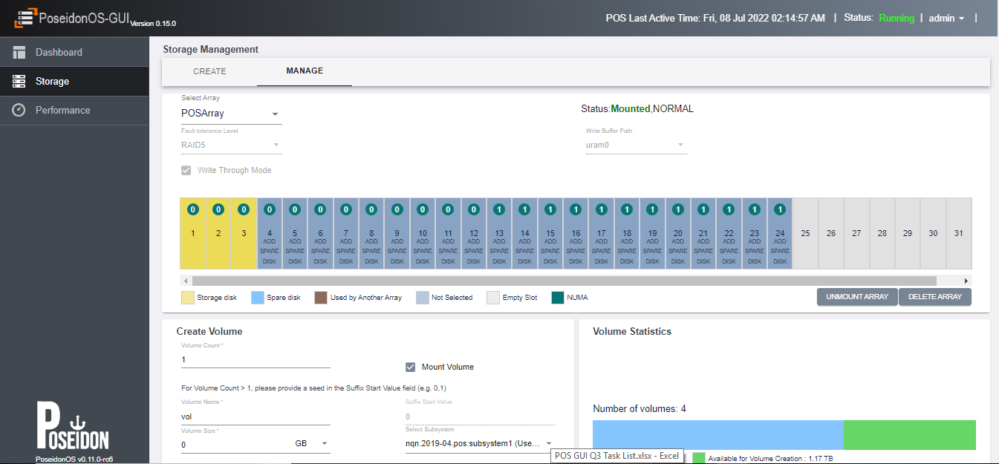
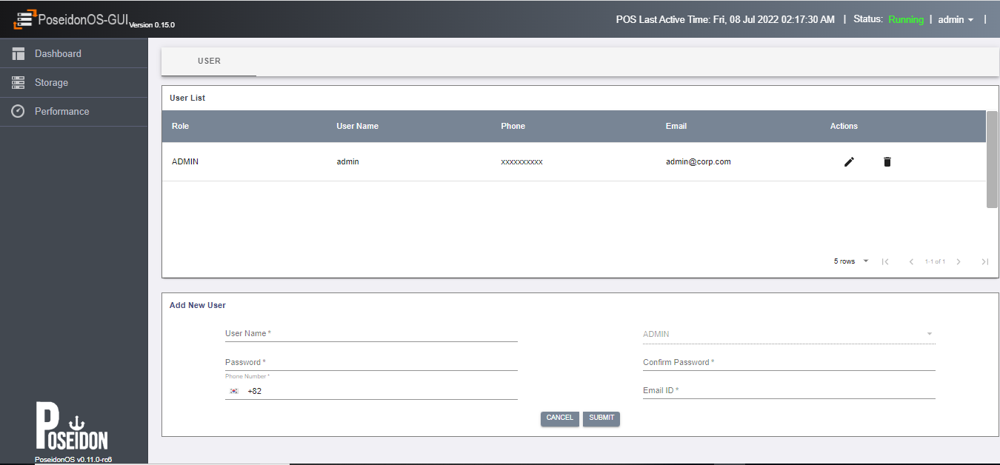
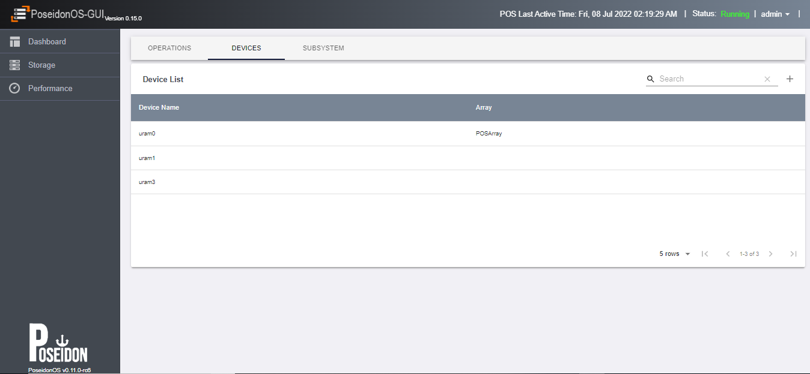
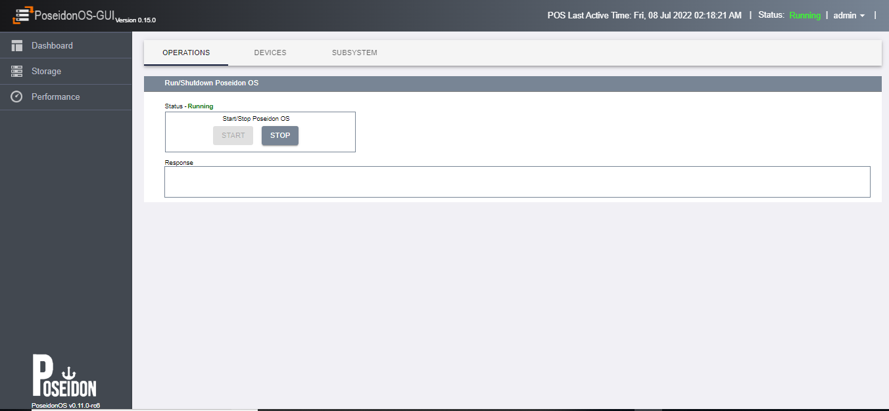

# POS Management Stack (M9K)
POS Management Stack is designed for management and monitoring of storage in PoseidonOS. It uses a client server model and consists of a client frontend application ([README](src/mtool/README.md)) (developed using reactjs) that facilitates users requests by interacting with a backend server application (developed using Python3). The backend application connects to a middleware server application (written using Golang) to interact with PoseidonOS system. The middleware application also hosts a REST API server ([README](src/dagent/README.md))

Storage Management enables array management, volume management and user management. Storage Monitoring enables to know the state and health of the storage. It consists of graphs and notification system (will be enabled soon). Graphs can be displayed for benchmarking of I/O, bandwidth, CPU utilization and other metrics gathered from POS (will be enabled soon).

# Implementation Details

As described above , POS Management Stack consists of a client (Poseidonos-GUI), backend server and middlewware server (API server that interacts with POS server). 
* Poseidonos-GUI is developed using Javascript framework [Reactjs](https://reactjs.org/) ([README](src/mtool/README.md))
* Backend server is developed using Python3 
* Middleware server (DAgent) is developed using GO ([README](src/dagent/README.md))
* Tested and works fine in the following latest modern browsers
    * Google Chrome 
    * Mozilla Firefox 
* PoseidonOS service is required to be installed and running already

# Features Supported
* Roles, Authentication and Authorization (Only Admin role is supported; default login credentials = admin/admin)
* Storage Management (Array and Volume management - creation, updation and deletion)
* Poseidon Administration (Start, Stop and Status)
* User Management (Create, update and remove user - only Admin role is supported)
* REST API provider ([README](src/dagent/README.md))

# Documentation

## User Guide
---
The official user guide is available here: src/mtool/doc/Samsung_iBOF_Management_Tool_User_Manual.pdf [User Guide](src/mtool/doc/Samsung_iBOF_Management_Tool_User_Manual.pdf)

## Getting Started
---
### Prerequisites 
1. python3
2. go v1.14+
3. nodejs 14.x
4. InfluxDB (1.8.x)
5. IP Address of Mellanox Port should be set (Please refer to the file src/dagent/README.md ([README](src/dagent/README.md)))
6. POS service is assumed to be available at "/usr/local/bin". If POS binary is not available in the "usr/local/bin" directory, then user will see an error when staring the pos (e.g. Poseidonos binary not found in /usr/local/bin/). In such a case, please build the poseidonos and run 'make install' from poseidonos root directory to correctly install the POS service


### Other Considerations 
1. Internet access is required for downloading the required packages
2. SSL certificates have to installed on the server or VM where Poseidonos-GUI will be installed
3. Python3 comes with Ubuntu 18.04, If not, please download and install it from https://www.python.org/downloads/
4. For Go v1.14+ follow the steps given at https://golang.org/doc/install to install the latest version of Go
5. For Node v1.14:
   - Download Nodejs tar.xz file from https://nodejs.org/en/download/
   - Extract the tar file using the command: sudo tar -xvf node-v14.x.x-linux-x64.tar.xz (Use the version instead of x)
   - Copy the contents of inside the extracted directory to /usr/bin directory using the command: sudo cp -r node-v14.x.x-linux-x64/{bin,include,lib,share} /usr/ 
6. node.js is required in the /usr/bin/ directory (you can copy using "sudo cp -r node-v14.x.x-linux-x64/{bin,include,lib,share} /usr/")
7. golang is required in the /usr/local directory (you can copy to  /usr/local)
8. Add golang path to environment using "export PATH=$PATH:/usr/local/go/bin" (this may be added in the profile (e.g. bashrc) file for persistence across sessions)
9. If you encounter any SSL related issues, you can set "npm config set strict-ssl false" for npm installation to work with SSL cert (this is a workaround in dev environment and not recommended in production environments).
10. For QOS settings maxiops and maxbw to work, a flag "fe_qos" should be set to "true" in /etc/pos/pos.conf (this step assumes that Poseidonos service is running already). After changing this flag, Poseidonos service has to be restarted from Poseidonos-GUI using the "Admin -> Poseidon Operations -> STOP & START"


### Supported OS and Version
1. Linux Ubuntu 18.04

### Supported PoseidonOS Version

1. POS v0.11.0-rc6 (Branch: release/v0.11.0 Commit: https://github.com/poseidonos/poseidonos/commit/47e69352f119ea03145051e5763df7ae3daddd95)

### Build and Run 
1. Clone the project from GitHub - https://github.com/poseidonos/poseidonos-gui
2. Navigate to poseidonos-gui directory
3. Run scripts as described below to install and run the application
(<b><i>You need to run these scripts as root or with a user with elevated permissions</i></b>)
4. Access the application in the browser (e.g. http://<local_ip_addr>)

```
1. git clone https://github.com/poseidonos/poseidonos-gui.git
2. cd poseidonos-gui
3. ./script/install_all.sh
4. ./script/build_all.sh
5. ./script/run_all.sh
6. Access the application from the browser

`
http://localhost
`
7. Access the REST API using a client (e.g. POSTMAN) at

`
http://localhost
`
```

# Screens
## Dashboard 
- (Location: src/mtool/ui/src/assets/images/dashboard_ui.png)
- 

## Array Management
- (Location: src/mtool/ui/src/assets/images/array_manage_ui.png)
- 

## Volume Management
- (Location: src/mtool/ui/src/assets/images/volume_create_ui.png)
- 

## User Management 
- (Location: src/mtool/ui/src/assets/images/user_management_ui.png)
- 

## Device Management
- (Location: src/mtool/ui/src/assets/images/device_management_ui.png)
- 

## Subsystem Management
- (Location: src/mtool/ui/src/assets/images/subsystem_management_ui.png)
- 

## Start and Stop Poseidon Operations
- (Location: src/mtool/ui/src/assets/images/start_stop_ui.png)
- 

# Scripts 
| S.No | Script Name             | Location           | Description                                                                                      | Notes                                                        |
|------|-------------------------|--------------------|--------------------------------------------------------------------------------------------------|--------------------------------------------------------------|
| 1    | install_all.sh          | script/            | Installs dependencies for GUI, DAgent and MAgent (e.g. nginx, influx)                         |                                                              |
| 2    | build_all.sh            | script/            | Builds various components into respective binaries (e.g. DAgent binary, GUI Binary)           |                                                              |
| 3    | run_all.sh              | script/            | Runs the binaries as services or applications (e.g. DAgent service, GUI web application)      |                                                              |
| 4    | run_os.sh               | src/dagent/script/ | Runs the POS binary                                                                           |                                                              |
| 5    | build_dagent.sh         | src/dagent/script/ | Builds Dagent code into binary                                                                | 1. Used internally by build_all.sh script (#2)               |
| 6    | run_dagent.sh           | src/dagent/script/ | Runs Dagent as a service                                                                      | 1. Used internally by run_all.sh script (#3)                 |
| 7    | build_magent.sh         | src/magent/script/ | Builds Magent code into binary                                                                | 1. Used internally by build_all.sh script (#2)               |
| 8    | run_magent.sh           | src/magent/script/ | Runs Magent as a service                                                                      | 1. Used internally by run_all.sh script (#3)                 |
| 9    | build_mtool.sh          | src/mtool/script/  | Builds Mtool code into binary                                                                 | 1. Used internally by build_all.sh script (#2)               |
| 10   | run_mtool.sh            | src/mtool/script/  | Runs MTool as a web application                                                               | 1. Used internally by run_all.sh script (#3)                 |
| 11   | dagent.service          | src/dagent/script/ | Registers Dagent as a service                                                                 | 1. Required and used internally by run_all.sh script (#3)    |
| 12   | magent.service          | src/magent/script/ | Registers Magent as a service                                                                 | 1. Required and used internally by run_all.sh script (#3)    |
| 13   | start-iBofMtool.service | src/mtool/script/  | Registers MTool backend API as a service                                                      | 1. Required and used internally by run_all.sh script (#3)    |
| 14   | uninstall.sh            | script/            | Uninstalls binaries and kills services  for GUI, DAgent and MAgent (e.g. nginx, influx)       |                                                              |

# Log Files
| S.No | Log Name   | Log Location             | Description                                     | Notes                             |
|------|------------|--------------------------|-------------------------------------------------|-----------------------------------|
| 1    | DAgent Log | /var/log/m9k/dagent1.log | API logs; errors or exceptions                  |  Currently set to log errors only |
| 2    | Influx Log | /var/log/syslog          | API logs; errors or exceptions                  |                                   |
| 3    | MAgent Log | /var/log/m9k/magent1.log | Metric collection logs; errors or exceptions    |                                   |
| 4    | GUI Log    | src/mtool/api/public/log | Rest API interaction logs; errors or exceptions |  This is created when GUI runs    |
| 5    | System Log | /var/log/syslog          | Various system level logs                       |                                   |

# Known Issues
1. URAM disks are not available in Poseidonos-GUI array creation step, after the server or vm was restarted
	- In such case, restart Poseidonos service from the Poseidonos-GUI using the "Admin -> Poseidon Operations -> START"
	- Please note that restarting the Poseidonos service from CLI will not resolve this issue. The Poseidonos service should be restarted from Poseidonos-GUI.
2. "Data Written" shows as 0 on the dashboard page of Poseidonos-GUI even when IO is performed
	- This happens in specific cases like when the entire volume storage space is consumed. It will be resolved in a future version.


# FAQ
1.  How to check whether POS is running (or check POS status)?
    1.  _Using GUI - The Right hand top corner shows the POS status (e.g. RUNNING)_
        
2.  How to restart POS?
    1.  _Use GUI and use the POS Operations page - (Admin -> Poseidon Operations -> STOP or START)_
        
3.  How to check which agents are running?
    1.  _ps_ _-aux |_ _grep_ _dagent_ _or_ _systemctl_ _status_ _dagent_ _or service_ _dagent_ _status_
    2.  _ps_ _-aux |_ _grep_ _magent_ _or_ _systemctl_ _status_ _magent_ _or service_ _magent_ _status_
    3.  _ps_ _-aux |_ _grep_ _app or_ _systemctl_ _status start-_ _iBofMtool_ _or service start-_ _iBofMtool_ _status   
        
4.  How to check influxdb is running ?
    1.  _ps_ _-aux |_ _grep_ _influxdb_ _or_ _systemctl_ _status_ _influxd_ _or service_ _influxd_ _status  
        
5.  How to restart Poseidonos-GUI? (We recommend restarting entire stack rather than individual components as shown below)
    1.  ./script/run_all.sh  
        
6.  How to check for any M9K errors or logs?
    1.  _/m9k/mtool/public/log (MTool logs - REST API interactions logs)_
    2.  _/var/log/m9k/ (_ _Dagent_ _and_ _Magent_ _)_
    3.  _/var/log/m9k/dagent1.log (POS API interactions are here - failed create/mount an array will be here)_
    4.  _/var/log/m9k/logmagent1.log (AIR data and CPU, Memory metrics data logs)_
    5.  _/var/log/syslog (_ _influxDB_ _logs-_ _grep_ _for text "influx")_
    
7.  GUI shows “POS is busy”. What should be done?
    1.  _In most of the cases, you can wait for 3-4 seconds and retry_
    2.  _In few cases, you may have to restart POS (by STOP and STOP operations from the GUI)_
        
        
8.  How to know what services are running as a part of GUI?
    1.  _Influx,_ _nginx_ _,_ _dagent_ _,_ _magent_ _,_ _Mtool_ _backend_  
        
        
9.  How to restart all components M9K ?
    1.  ./m9k/run_all.sh  
        
        
10. Is there a limit of volumes per array ?
    1.  Yes, it is 256  
          
        
11. Is there a specific directory from which POS should be installed?
    1.  There is no specific directory from which POS should be installed. POS service is assumed to be available at "/usr/local/bin". If POS binary is not available in the "usr/local/bin" directory, then user will see an error when staring the pos (e.g. Poseidonos binary not found in /usr/local/bin/). In such a case, please build the poseidonos and run 'make install' from poseidonos root directory to correctly install the POS service


12. What are the default login credentials for the UI? 
    1. Username: admin
    2. Password: admin

13. What is "MTool"?
    1. It is an internal name for Poseidonos-GUI project, the client application of the M9K

14. What is "POS"?
    1. It is an internal name for Poseidonos server

15. What should I do if I am unable to properly start Poseidonos service from the "Admin" menu?
    1. This can mean that Poseidonos service may not be installed correctly. Please make sure Poseidonos is installed correctly. You can also try to run setup_env.sh script (this script  is available in script directory in the Poseidonos repo)
